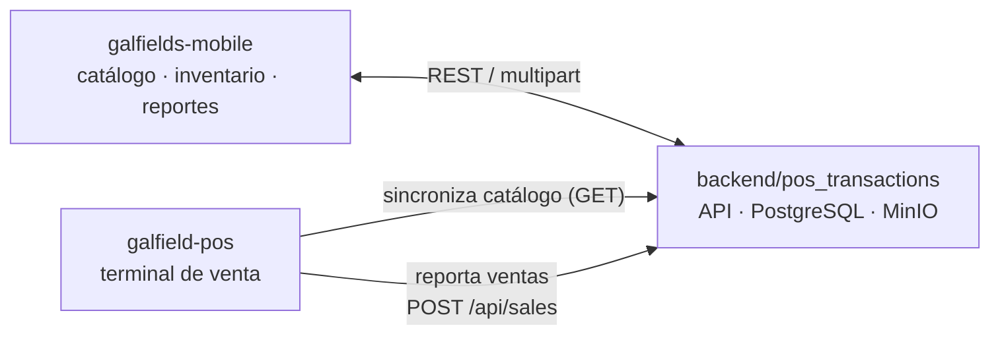

# CLAUDE.md

This file provides guidance to Claude Code (claude.ai/code) when working with code in this repository.

## Project

Galfields — a POS (point of sale) system for a single business. Monorepo with three independent components that share one central API:

| Path | What it is | Stack |
|---|---|---|
| [`backend/pos_transactions`](backend/pos_transactions) | Cloud API — source of truth for catalog, inventory, sales, reports | Spring Boot 4.1, Java 21, Gradle (Clean Architecture, multi-module), PostgreSQL, MinIO |
| [`apps/galfield-pos`](apps/galfield-pos) | Desktop POS terminal (offline-first) | Tauri 2, Vue 3, TypeScript, Vite |
| [`apps/galfields-mobile`](apps/galfields-mobile) | Mobile app — catalog management, inventory, reports | Expo 54, React Native 0.81, expo-router |

**Each component has its own `CLAUDE.md` and it is the primary, up-to-date documentation of that component** — architecture, gotchas, endpoint contracts, migration history, and hard-won incident context all live there, not here. Read the relevant one(s) before working in that area:

- [`backend/pos_transactions/CLAUDE.md`](backend/pos_transactions/CLAUDE.md)
- [`apps/galfield-pos/CLAUDE.md`](apps/galfield-pos/CLAUDE.md)
- [`apps/galfields-mobile/CLAUDE.md`](apps/galfields-mobile/CLAUDE.md)

`backend/pos_transactions` replaced the original `backend/pos` (layered architecture) via `specs/04-migracion-pos-clean-architecture.md` — same API contract, same Postgres schema, same MinIO bucket, same k8s Service/Deployment, restructured internally onto Clean Architecture. `backend/pos` no longer exists in this repo.

This root file only covers what's true across all three: how they connect, and where to look for what.

## How the components connect



- **`backend/pos_transactions`** is the single source of truth: catalog, inventory, and the real sales history all live there.
- **`galfields-mobile`** manages that catalog directly and reads reports/inventory live against the API. It's also where store-wide config gets set centrally: invoice numbering ranges per terminal, and the reports access code cashiers need to enter on the desktop POS.
- **`galfield-pos`** is offline-first with a local SQLite DB: it pulls the catalog on demand, sells locally with no internet required, and pushes each sale back to the cloud in the background once connectivity returns (outbox pattern, idempotent via a client-generated UUID per sale).

Both apps point at the backend URL **configurably at runtime** (each app's Configuración/Settings screen, backed by local storage), never a hardcoded/build-time URL — one installation can point at a different backend without a rebuild.

Cross-cutting flows that touch all three components (read the relevant CLAUDE.md sections on each side before changing any one part):
- **Sale recording**: `galfield-pos` outbox → `POST /api/sales` → shows up in `galfields-mobile`'s Historial de facturas.
- **Invoice numbering (DIAN-compliant)**: ranges assigned per terminal from `galfields-mobile` → pulled by `galfield-pos` → snapshotted onto each sale → echoed back through the reports API.
- **Reports access gate**: code generated from `galfields-mobile` → validated by `galfield-pos` against the backend before letting a cashier into its Reportes module.
- **Sale units with conversion factors** (spec `03-unidades-venta-conversion`): a variant can be sold under multiple presentations sharing the same physical stock (e.g. "Media"/"Completa" cajetilla of the same SKU). Units are managed per-variant from `galfields-mobile`'s product detail screen (Unidades de venta) → `backend/pos_transactions`'s `product_units` hangs off `product_variants.variant_id`, not `products.product_id` → `galfield-pos`'s `sync.rs` pulls each unit down as its own local row (sibling rows share `remote_variant_id`, since that's what the physical stock is actually keyed by) → sold via the POS's unit picker (opens only when a product has more than one) → reported to `POST /api/sales` with a `productUnitId` per line → the backend converts to base units for the stock decrement and snapshots the unit's name/factor onto `sale_items`.

## Commands

Each app has its own commands (see its CLAUDE.md for the full list); quick reference:

```bash
# backend/pos_transactions — Spring Boot / Gradle (multi-module)
cd backend/pos_transactions
./gradlew build
./gradlew :app-service:bootRun
./gradlew test
./gradlew :usecase:test --tests "co.com.galfields.pos_transactions.usecase.report.ReportUseCaseTest"

# apps/galfield-pos — Tauri desktop
cd apps/galfield-pos
npm run tauri dev       # Vite + Tauri window
npm run tauri build     # production installer
cd src-tauri && cargo test

# apps/galfields-mobile — Expo
cd apps/galfields-mobile
npm start                # Expo dev server / Expo Go
npm run android
npm run lint
```

There is no repo-wide build/test/lint command — each app is built, linted, and tested independently, from its own directory.

## Skills

- When user interface designs are required, use the frontend-design skill.
- For the answers, I should always use the full caveman skill and writing in spanish
- For complex implementations across multiple projects, the /spec /spec-impl skill should always be used.


## CI/CD

- `backend/pos_transactions`: on push to `master` touching `backend/pos_transactions/**`, builds and pushes a Docker image (`.github/workflows/deploy-pos-transactions.yml` → `_build-push.yml`), then pins the new image sha into a separate infra repo (`infra-repo-kinforgeworks`) which ArgoCD syncs from. Deploys automatically on merge — there is no manual promotion step. Same k8s service/namespace the old `backend/pos` used (`_build-push.yml`'s `service: pos-backend` input is unchanged on purpose — this is a code migration, not a new workload).
- `apps/galfield-pos`: builds desktop installers (Windows/macOS/Linux) on push to `master` touching that path, and again on `galfield-pos-v*` tags (with a guard that the tag matches `tauri.conf.json`'s version). Artifacts only — no auto-deploy, distributed by downloading the installer from the workflow run.
- `apps/galfields-mobile`: EAS Android build, tag-triggered only (`galfields-mobile-v*`), never on plain pushes. `eas submit` (Play Store publish) is still manual.

## Conventions across the repo

- Commit messages: Conventional Commits style, scoped to the affected component(s), e.g. `fix(backend,desktop,mobile): ...`, `feat(desktop,mobile): ...`. PRs are merged (not squashed) into `master`.
- Source code (identifiers, comments, log messages, SQL) is written in English across all three components; user-facing UI text and strings stay in Spanish. See `apps/galfield-pos/CLAUDE.md`'s "Idioma del código" section for the explicit rule — it applies the same way in the other two components.
- There is no shared/cross-app package — the three components don't import from each other; they only interact over HTTP.
