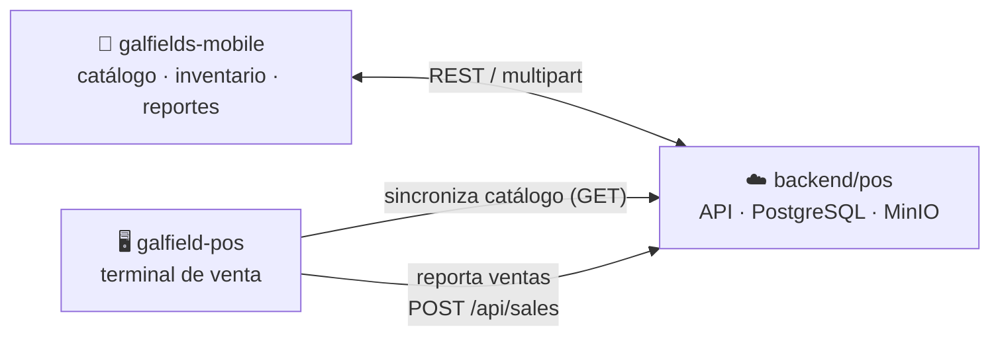

# Galfields

Sistema de punto de venta para Galfields: catálogo, inventario, ventas y reportes conectados en la nube. Monorepo con tres componentes independientes que hablan con una única API central.

## Componentes

| | Qué es | Stack | Documentación |
|---|---|---|---|
| [`backend/pos`](backend/pos) | API en la nube — fuente de verdad de catálogo, inventario, ventas y reportes | Spring Boot 4 · Java 21 · PostgreSQL · MinIO | [README](backend/pos/README.md) · [CLAUDE.md](backend/pos/CLAUDE.md) |
| [`apps/galfield-pos`](apps/galfield-pos) | Terminal de punto de venta de escritorio | Tauri 2 · Vue 3 · TypeScript | [README](apps/galfield-pos/README.md) · [CLAUDE.md](apps/galfield-pos/CLAUDE.md) |
| [`apps/galfields-mobile`](apps/galfields-mobile) | App móvil — catálogo, inventario y reportes | Expo 54 · React Native | [README](apps/galfields-mobile/README.md) · [CLAUDE.md](apps/galfields-mobile/CLAUDE.md) |

## Cómo se conectan

- **`backend/pos`** es la única fuente de verdad: ahí viven el catálogo, el inventario y el historial real de ventas.
- **`apps/galfields-mobile`** administra ese catálogo directamente y consulta reportes/inventario en vivo contra la API.
- **`apps/galfield-pos`** trabaja offline-first con una base SQLite local: sincroniza el catálogo bajo demanda, vende localmente aunque no haya internet, y reporta cada venta de vuelta a la nube en segundo plano apenas hay conexión.

Tanto el POS de escritorio como la app móvil apuntan a la URL del backend de forma **configurable en runtime** (desde la pantalla de Configuración de cada uno), no hardcodeada — cada instalación puede apuntar a un backend distinto sin necesidad de una build nueva.

## Empezar

Cada componente tiene su propio README con instrucciones de instalación y ejecución:

- [`backend/pos/README.md`](backend/pos/README.md)
- [`apps/galfield-pos/README.md`](apps/galfield-pos/README.md)
- [`apps/galfields-mobile/README.md`](apps/galfields-mobile/README.md)

Para arquitectura, convenciones de código, y el porqué de cada decisión de diseño, cada componente tiene su propio `CLAUDE.md` — es la documentación más completa y actualizada de este proyecto.
