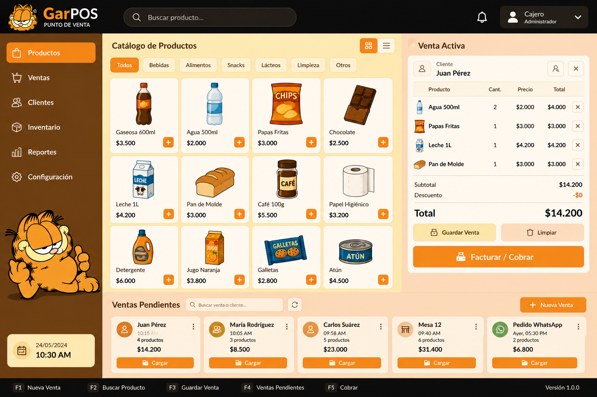
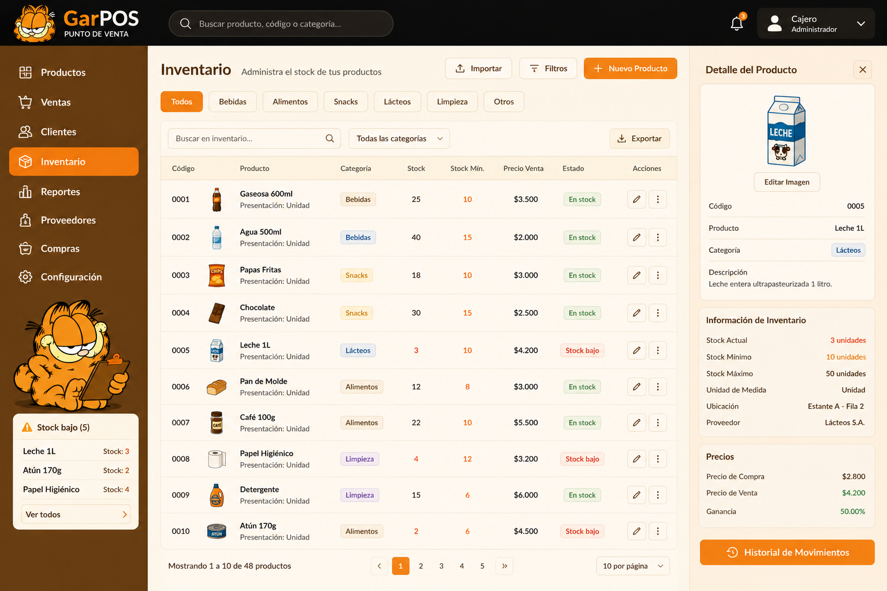
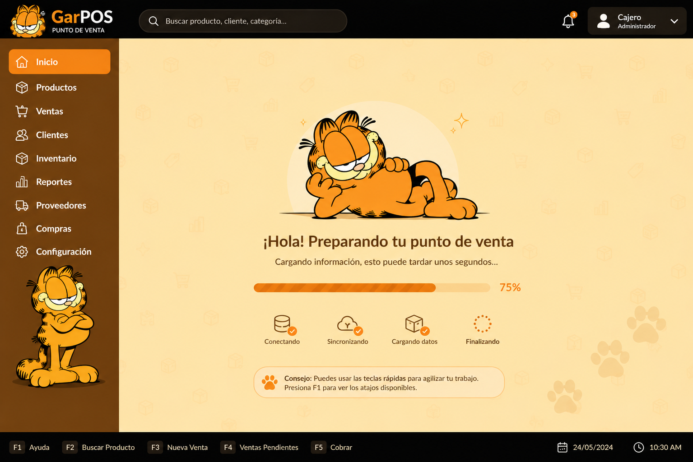
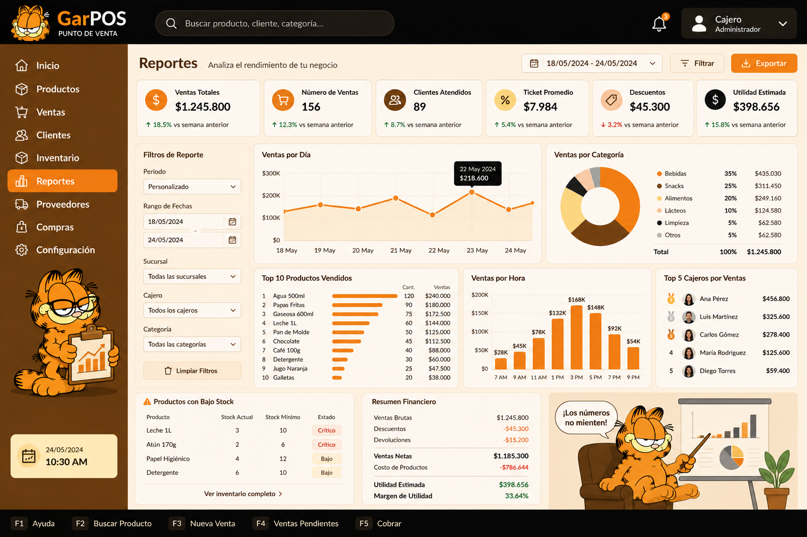
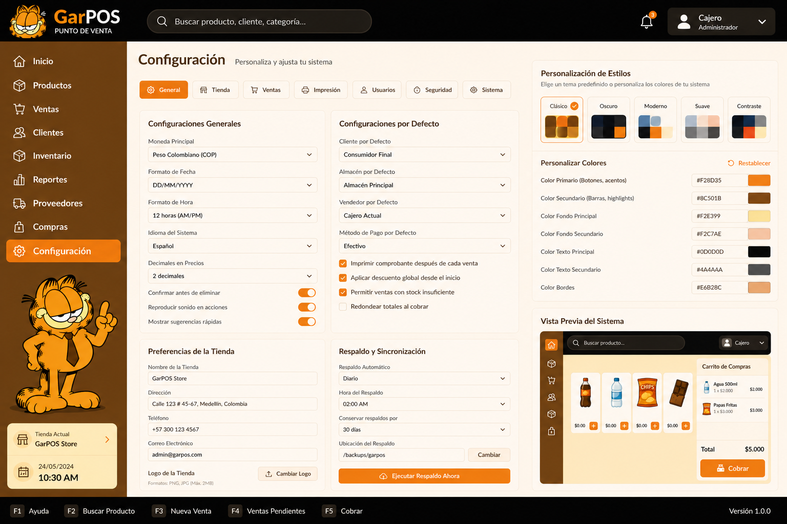

# CLAUDE.md

This file provides guidance to Claude Code (claude.ai/code) when working with code in this repository.

## Stack

**Tauri 2 + Vue 3 + TypeScript + Vite** desktop POS app for Galfields.

- Frontend: `src/` — Vue 3 SFCs using `<script setup>` syntax
- Backend: `src-tauri/src/` — Rust (Tauri 2 commands)

## Commands

```bash
npm run tauri dev      # full dev mode: starts Vite (port 1420) + Tauri window
npm run tauri build    # production build + bundle installer
npm run dev            # frontend only (Vite), no Tauri window
npm run build          # frontend type-check (vue-tsc) + Vite build only
```

There are no tests yet. Cargo tests can be run from `src-tauri/`:
```bash
cd src-tauri && cargo test
```

## Architecture

The app is split into two processes that communicate via Tauri's IPC bridge:

- **Vite dev server** is locked to port 1420 (`strictPort: true`). Tauri's `beforeDevCommand` starts it automatically when you run `tauri dev`.
- **Rust → JS**: Tauri commands are defined in `src-tauri/src/lib.rs`, registered via `invoke_handler!`, and called from Vue using `invoke()` from `@tauri-apps/api/core`.
- **Capabilities / permissions** for Tauri plugins are declared in `src-tauri/capabilities/default.json`. Any new plugin capability must be added there.
- **Bundling** is configured in `src-tauri/tauri.conf.json`. The frontend dist is at `../dist` relative to `src-tauri/`.
- **Routing**: `src/router/index.ts` uses `createWebHashHistory` (required — Tauri serves from `dist/` with no server-side routing) with one lazy-loaded route per feature (`/pos`, `/inventario`, `/reportes`, `/sync`, `/configuracion`), each pointing at that feature's `<Name>View.vue`.
- **Shared state — module-level singletons, no Pinia**: `src/composables/useAppConfig.ts`, `useToast.ts`, and `usePaymentMethods.ts` each export a `reactive`/`ref` declared at module scope, so every component calling the composable shares the same instance without a store library. `useAppConfig` is the important one: it loads `config` once (`get_settings` → `src/utils/settingsMapper.ts`'s `applyRecord`, which maps the flat `key → value` rows from the `app_settings` table onto the nested `ConfigSettings` shape) and a `watchEffect` re-applies `config.styles` as CSS custom properties on `:root` any time it changes. That means the Garfield palette below (`## Mockups de módulos`) is the *default* seed data, not a hardcoded theme — colors are runtime-configurable from the Configuración module.
- **Shared TypeScript types** live in `src/types/index.ts` (`Product`, `CartItem`, `PendingSale`, `ConfigSettings`, etc.) — check there before adding a duplicate interface in a feature folder.

## Backend modules (`src-tauri/src/`)

Each module owns one domain's `#[tauri::command]`s, all registered in `lib.rs`'s `invoke_handler!`:

- `db/mod.rs` — opens `<app_data_dir>/galfield.db` (SQLite via `rusqlite`, bundled) and runs migrations.
- `settings.rs` — generic key/value store (`app_settings` table) for app config: `get_settings`/`save_settings`.
- `pending_sales.rs` — full CRUD for held/parked sales (`save_pending_sale`/`get_pending_sales`/`delete_pending_sale`).
- `payment_methods.rs`, `reports.rs`, `products.rs` — **read-only** aggregate queries: `list_payment_methods`; `reports.rs`'s `get_sales_summary`/`get_top_products`/`get_financial_summary` all aggregate `sales`/`sale_items` over a `[date_from, date_to]` range (period-over-period comparison is composed by calling a command twice from the frontend, not done in Rust); `products.rs`'s `get_low_stock_products` filters `products` by a fixed stock threshold. There is no product create/update/delete command yet — the Inventory feature (`src/features/inventory/`) still runs entirely on hardcoded mock data, unconnected to the real `products` table. Don't confuse this module with `src/features/products/`, an empty, unused scaffold folder from initial setup.
- `invoices.rs` — sale creation plus the printer/cash-drawer `trigger_*` commands (see Peripheral event model below); owns `get_port_lock`.
- `peripheral_manager.rs` / `peripherals.rs` — continuous peripheral listeners (barcode scanner) and device discovery (`list_serial_ports`, `list_video_devices`).

Some report/inventory metrics are intentionally out of scope until the schema grows: `products` has no `min_stock` or cost/purchase-price column, and `sales` has no `seller` column — so per-product reorder thresholds, margin/COGS, and top-cashier reporting all need a new migration (see below) before they can be real instead of mocked.

### Database migrations

- Plain `.sql` files in `src-tauri/migrations/`, embedded at compile time via `include_str!` and applied in `db::run_migrations`.
- Each migration is applied at most once, tracked by filename in the `schema_migrations` table — required because later migrations use non-idempotent DDL (`ALTER TABLE ... ADD COLUMN`), unlike `001_initial.sql` which is safe to re-run.
- Adding a migration: create `src-tauri/migrations/NNN_description.sql`, then wire it up with an `apply_migration("NNN_description", include_str!(...))` call in `run_migrations`.
- SQL identifiers stay in English (see language rule below) even though schema comments/docs may be in Spanish.

## Peripheral event model

Hardware peripherals (barcode scanner, printer, cash drawer, …) are never driven by a
plain `invoke()` call awaited for its result. Instead they follow a fire-and-listen
split: a Tauri command *dispatches* the action, and the outcome arrives later as a
Tauri event. This is what lets independent peripheral actions (e.g. printing a
receipt and opening the cash drawer) run without one blocking, delaying, or being
skipped because of the other's success or failure.

- **Event naming**: `peripheral-<device>-<event>`, e.g. `peripheral-barcode-found`,
  `peripheral-printer-status`, `peripheral-cash-drawer-error`.
- **Rust side** (`src-tauri/src/peripheral_manager.rs`, `src-tauri/src/invoices.rs`):
  a `#[tauri::command]` spawns a `std::thread` that does the actual I/O (read/write to
  a serial port or raw device file) and emits a `peripheral-<device>-status` or
  `peripheral-<device>-error` event via `AppHandle::emit` when it's done. The command
  itself returns almost immediately — its `Result` only reflects whether the job was
  *dispatched*, not whether the hardware action *succeeded*.
- **Two shapes, same convention**:
  - *Continuous listeners* (barcode scanner, future fingerprint reader): started with
    `start_peripheral_listener(deviceType, port)`, stopped with
    `stop_peripheral_listener(deviceType)`, tracked in `AppState.peripheral_stops` so a
    new start can cancel a previous one. Emits events repeatedly for as long as it runs.
  - *One-shot actions* (printer, cash drawer): dedicated `trigger_*` commands
    (`trigger_print_invoice`, `trigger_open_cash_drawer`) with no stop/state tracking —
    the thread does one job and exits. Emits exactly one `-status` or `-error` event.
- **Same-port serialization**: two one-shot actions can target the same physical port
  (the cash drawer is wired through the printer's RJ11, so both write to
  `printer_port`). Opening that device file from two threads at once fails or corrupts
  the output, so each `trigger_*` command grabs a per-port `Arc<Mutex<()>>` from
  `AppState.port_locks` (`invoices::get_port_lock`) *before* spawning its thread, and the
  thread holds that lock only around the `write_to_port` call. A second trigger for the
  same port simply blocks until the first one releases it, then proceeds — this keeps
  "independent of the other's success" true (the drawer still opens whether or not
  printing succeeded) while making sure they never write to the port at the same instant.
  This is transparent to the frontend: no polling, delay, or sequencing needed there.
- **Vue side** (`src/composables/peripherals/`): **one composable per device**, each the
  only place that knows its own event names and payload shapes (SRP — a change to
  printer events touches `usePrinterBus.ts` only, never barcode or cash-drawer code):
  - `useListenerDevice.ts` — generic, device-agnostic `startDevice(deviceType, port)` /
    `stopDevice(deviceType)` wrapper around the continuous-listener commands, plus the
    shared `DeviceStatusPayload` type. Knows nothing about any specific device.
  - `useBarcodeBus.ts` — barcode-only events (`onBarcodeFound`, `onBarcodeNotFound`,
    `onBarcodeStatus`, `onBarcodeError`); composes `useListenerDevice` for its
    start/stop lifecycle.
  - `usePrinterBus.ts` — printer-only: `triggerPrint`, `onPrinterStatus`, `onPrinterError`.
  - `useCashDrawerBus.ts` — cash-drawer-only: `triggerCashDrawer`, `onCashDrawerStatus`,
    `onCashDrawerError`.
  Each exposes `on<Device><Event>()` subscribers (returning `UnlistenFn`, matching
  `@tauri-apps/api/event`'s `listen()`) and, for one-shot devices, a `trigger*` dispatch
  function. Feature composables (e.g. `useBarcodeScanner.ts` uses `useBarcodeBus`;
  `useCheckout.ts` uses `usePrinterBus` + `useCashDrawerBus`) subscribe to the events
  they care about in `onMounted`, clean up in `onUnmounted`, and treat
  `trigger*`/`startDevice` calls as fire-and-forget — business logic branches on the
  event payload, never on whether the dispatching `invoke()` resolved.

**Extending to a new peripheral:**
1. Continuous listener → add a `spawn_<device>_listener` in `peripheral_manager.rs` and
   handle its `device_type` string in `start_peripheral_listener`. One-shot action → add
   a new `trigger_<action>` command (see `trigger_open_cash_drawer` for the minimal shape).
2. Emit `peripheral-<device>-status` / `peripheral-<device>-error` (reuse
   `peripheral_manager::DeviceStatusPayload` when a plain `{ connected, port }` shape fits).
3. Add a new `use<Device>Bus.ts` file under `src/composables/peripherals/` with that
   device's `on<Device>*` / `trigger*` helpers — don't add another device's events to an
   existing device's file, and don't call `listen()` directly outside this folder.
4. Subscribe from the feature composable that needs it.

## Modal convention

There's no shared `<Modal>` component — every modal (`SaveSaleModal.vue`, `PaymentMethodModal.vue`,
`ReportsPasswordModal.vue`, `InvoiceModal.vue`, …) is a standalone SFC that copies the same
`.modal-backdrop`/`.modal-card`/`.modal-header`/`.modal-body`/`.modal-footer` structure and
`Transition name="modal"` + `modal-in`/`modal-out` keyframe CSS. When adding a new modal, copy an
existing one's markup/CSS (`SaveSaleModal.vue` is the simplest reference) rather than inventing new
chrome. Props are always `visible: boolean`; emits are always `confirm`/`cancel`.

## VS Code

Recommended extensions are in `.vscode/extensions.json`: Vue - Official (Volar), Tauri, and rust-analyzer.

# Principios que debes aplicar obligatoriamente
- SOLID: cada componente tiene una sola responsabilidad
- DRY: cero lógica duplicada, extraer composables para lógica reutilizable
- Escalabilidad: estructura de carpetas por feature, no por tipo de archivo
- TypeScript estricto: interfaces para todos los modelos, sin `any`
- Separación clara: UI → Composable → Tauri Command (nunca lógica de negocio en el template)

# Idioma del código — regla obligatoria
Todo el código fuente **debe estar en inglés**: variables, funciones, structs, interfaces, enums, tipos, nombres de archivos, tablas SQL, columnas SQL, comentarios en código, y mensajes de log.
- Permitido en español: texto visible al usuario (labels, placeholders, mensajes de UI), contenido de strings literales en seeds SQL.
- Incorrecto: `let nombreProducto`, `fn guardar_config()`, `CREATE TABLE ventas`
- Correcto: `let productName`, `fn save_config()`, `CREATE TABLE sales`

# Restricciones
- Sin Pinia por ahora — los composables manejan el estado local del módulo
- Sin llamadas HTTP — toda comunicación con datos via invoke() de Tauri
- Sin lógica en templates — todo en composables o métodos del setup
- Los componentes shared deben ser genéricos, sin acoplamiento al módulo POS

## Mockups de módulos

### Tema visual: Garfield — colores cálidos

Paleta:
  - #0D0D0D fondo oscuro
  - #F28D35 naranja primario
  - #8C501B café acento
  - #F2E399 crema claro
  - #F2C7AE durazno suave

### Layout: 
sidebar izquierdo fijo, contenido a la derecha

### Módulo POS


### Módulo Inventario  


### Módulo sincronización


### Módulo reportes


### Módulo configuración
