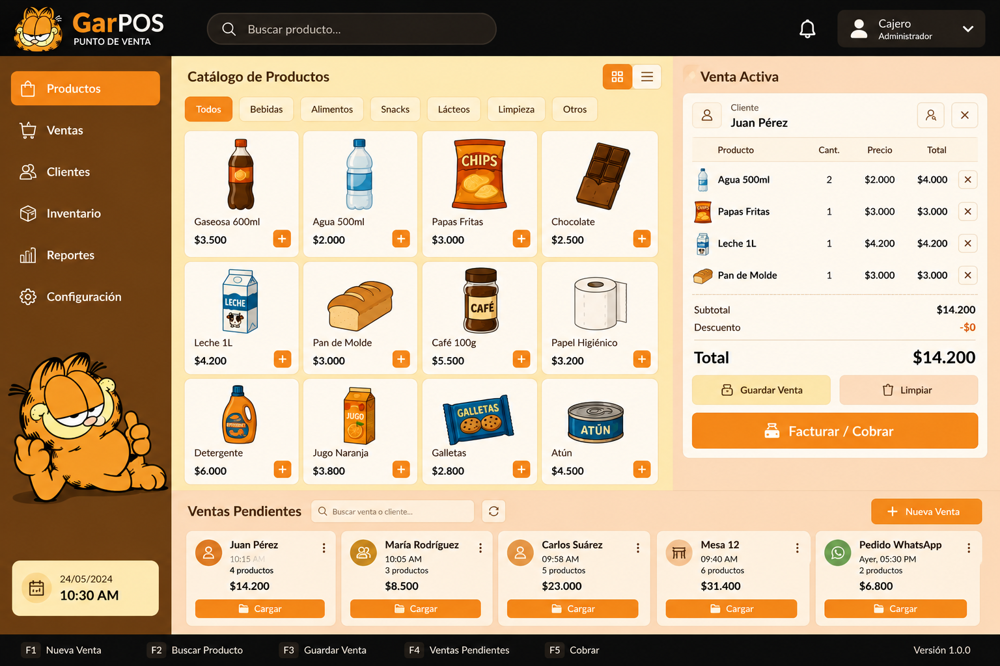
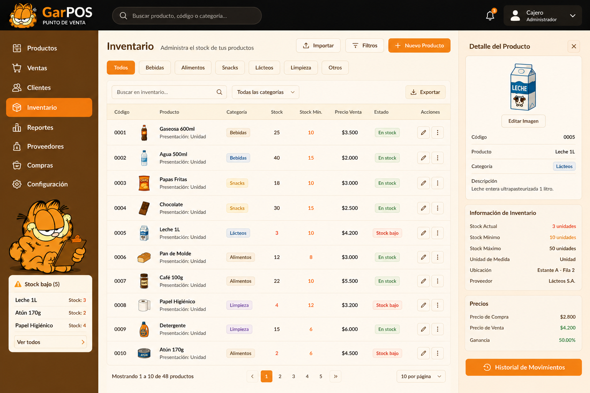
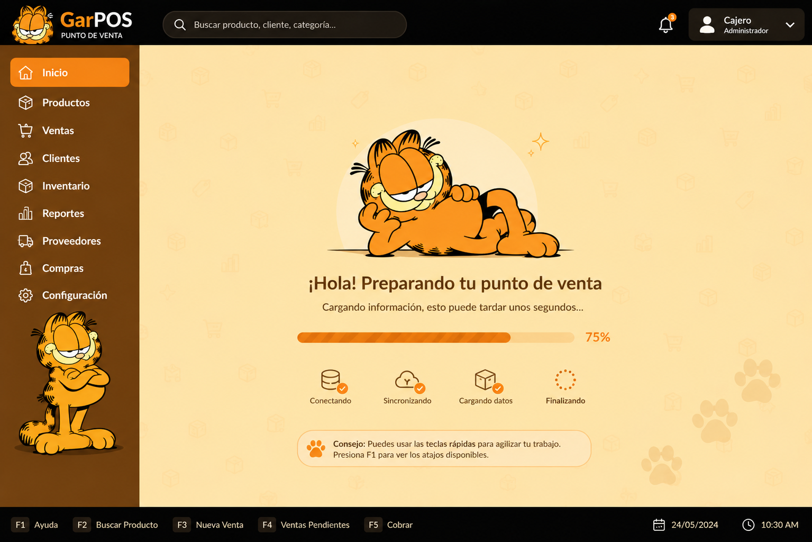
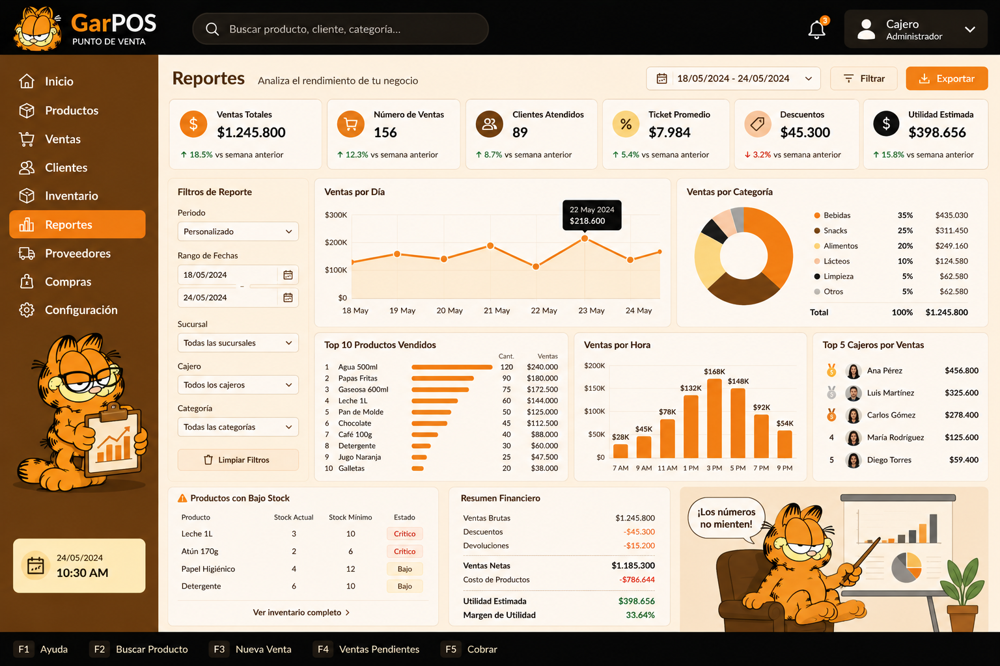
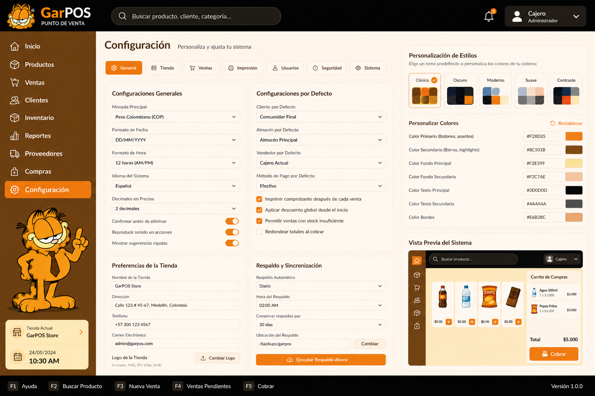

# CLAUDE.md

This file provides guidance to Claude Code (claude.ai/code) when working with code in this repository.

## Stack

**Tauri 2 + Vue 3 + TypeScript + Vite** desktop POS app for Galfields.

- Frontend: `src/` — Vue 3 SFCs using `<script setup>` syntax
- Backend: `src-tauri/src/` — Rust (Tauri 2 commands)

## Commands

```bash
npm run tauri dev      # full dev mode: starts Vite (port 1420) + Tauri window
npm run tauri build    # production build + bundle installer
npm run dev            # frontend only (Vite), no Tauri window
npm run build          # frontend type-check (vue-tsc) + Vite build only
```

No frontend tests yet. `src-tauri/src/auth.rs` has the first Rust tests in this codebase (`#[cfg(test)]`, real temp-SQLite-backed, see "Employee login / session" below) — run from `src-tauri/`:
```bash
cd src-tauri && cargo test
```

## Architecture

The app is split into two processes that communicate via Tauri's IPC bridge:

- **Vite dev server** is locked to port 1420 (`strictPort: true`). Tauri's `beforeDevCommand` starts it automatically when you run `tauri dev`.
- **Rust → JS**: Tauri commands are defined in `src-tauri/src/lib.rs`, registered via `invoke_handler!`, and called from Vue using `invoke()` from `@tauri-apps/api/core`.
- **Capabilities / permissions** for Tauri plugins are declared in `src-tauri/capabilities/default.json`. Any new plugin capability must be added there.
- **Bundling** is configured in `src-tauri/tauri.conf.json`. The frontend dist is at `../dist` relative to `src-tauri/`.
- **Routing**: `src/router/index.ts` uses `createWebHashHistory` (required — Tauri serves from `dist/` with no server-side routing) with one lazy-loaded route per feature (`/pos`, `/inventario`, `/reportes`, `/sync`, `/configuracion`), each pointing at that feature's `<Name>View.vue`.
- **Shared state — module-level singletons, no Pinia**: `src/composables/useAppConfig.ts`, `useToast.ts`, and `usePaymentMethods.ts` each export a `reactive`/`ref` declared at module scope, so every component calling the composable shares the same instance without a store library. `useAppConfig` is the important one: it loads `config` once (`get_settings` → `src/utils/settingsMapper.ts`'s `applyRecord`, which maps the flat `key → value` rows from the `app_settings` table onto the nested `ConfigSettings` shape) and a `watchEffect` re-applies `config.styles` as CSS custom properties on `:root` any time it changes. That means the Garfield palette below (`## Mockups de módulos`) is the *default* seed data, not a hardcoded theme — colors are runtime-configurable from the Configuración module. `applyStyles` derives **13 CSS vars from only 4 of the 5 user-facing color fields** (`bgColor`/`lightBg`/`primaryColor`/`lightText`, via fixed alpha blends and lighten/darken shifts) — `secondaryText` only ever reaches `--color-accent`, which has exactly one consumer in the whole app (the scrollbar thumb in `main.css`), so changing it is barely visible anywhere. `--color-success`/`--color-danger`/`--color-warning` are fixed in `main.css` and never touched by `applyStyles` — status colors stay semantically consistent regardless of theme, on purpose, not configurable from Personalización de Estilos.
- **Configuración's `settings` is an isolated draft, not the live `config` singleton** (`useConfig.ts`, explicit comment: "isolated from the global singleton so the user can discard unsaved changes without affecting the running app") — editing colors doesn't touch the rest of the running app until `save()` calls `save_settings` then `reloadConfig()`. The **only** live feedback while editing is `ConfigFormStyles.vue`'s "Vista Previa del Sistema" widget, bound to `--pw-bg`/`--pw-primary`/`--pw-text` (all three sourced straight from `settings.styles`, not hardcoded) — if you add a new configurable color field, wire a matching `--pw-*` var here too, or the preview goes back to lying about that field the same way it used to for background/text before this was fixed.
- **Shared TypeScript types** live in `src/types/index.ts` (`Product`, `CartItem`, `PendingSale`, `ConfigSettings`, etc.) — check there before adding a duplicate interface in a feature folder.

## Backend modules (`src-tauri/src/`)

Each module owns one domain's `#[tauri::command]`s, all registered in `lib.rs`'s `invoke_handler!`:

- `db/mod.rs` — opens `<app_data_dir>/galfield.db` (SQLite via `rusqlite`, bundled) and runs migrations.
- `auth.rs` — employee login/session (spec `01-login-empleados-roles`, step 13 of 17). See "Employee login / session" below.
- `http_client.rs` — every outbound call to the cloud (`sync.rs`, `catalog_sync.rs`, `sales_sync.rs`) goes through this instead of each module building its own bare `reqwest::Client`. Holds the single shared `reqwest::Client` (connection pooling, built once via `OnceLock`). `get`/`post_json` log the method, URL, request body (POST only), response status, and response body on every call via `logging::step` — that's the "interceptor" for API visibility during dev (`npm run tauri dev`'s terminal), not user-facing UI. `parse_json(context, body)` is the centralized point for turning "the cloud answered but the JSON shape didn't match" into an error: it tags the message with `context` (`"module::function"`) so the string that reaches the frontend names the exact call site, instead of three copy-pasted `.map_err(|e| format!("Respuesta inesperada..."))` sites each saying the same generic thing. Add any new cloud call/JSON parse through this module, not a fresh `reqwest::Client::new()` or bare `serde_json::from_str`, or it silently loses both the logging and the context tag.
- **Every call now takes a `token: Option<&str>`** (spec `01-login-empleados-roles` step 16) — `get`/`post`/`post_json` attach it as `Authorization: Bearer <token>` via `reqwest`'s own `.bearer_auth()` when `Some`, straight through to `send`. Callers fetch it the same "lock, read, drop, then await" way they already fetch `api_base_url(&db)` — `crate::auth::auth_token(&db)`, reading `employee_session.jwt` — usually in the same scoped block as the base URL read (e.g. `let (api_base_url, token) = { let db = state.db.lock()...; (http_client::api_base_url(&db), auth::auth_token(&db)) };`). `None` for two cases: `auth::login` itself (always public, and any previously-cached token would be for whichever employee was logged in *before*, not the one currently authenticating), and simply whenever nothing is cached yet. **`auth_token` itself still doesn't check `expires_at`** — only `get_session`/`session_if_valid` do (see "Session expiry" below, spec step 17), so a token can still be read and sent past its expiry via a path that never goes through `get_session` first, most notably `sales_sync.rs`'s background retry loop, which calls `auth_token(&db)` directly and isn't driven by the Vue-side session refresh at all. When that happens, the backend just rejects it with a normal 401 like any other invalid/missing token, and every caller already treats a non-2xx `HttpResponse` as a graceful error to surface, not something to unwrap/panic on — so an expired session degrades to "sync/sale reporting fails with a clean message" rather than crashing, satisfying this step's test criterion without any special-casing there either.
- **Cloud API base URL is a runtime setting, not a hardcoded constant** — `http_client::api_base_url(&db)` reads `sync.api_base_url` from `app_settings` (migration `007_api_base_url_setting`, seeded to `https://galfields.kinforgeworks.com`, same as the old constant's value), editable from Configuración → Reglas y Sincronización (`ConfigFormDefaults.vue`, `settings.sync.apiBaseUrl` via `settingsMapper.ts`). `DEFAULT_API_BASE_URL` still exists as a fallback for the rare case the setting row is missing (a local DB older than migration 007 that hasn't run yet), but every real call goes through `api_base_url(&db)`. **Every caller (`sync.rs`, `catalog_sync.rs`, `sales_sync.rs`) reads it fresh, in a scope that drops the `MutexGuard` before the next `.await`** — same "lock, read, drop, then await" pattern already used for other settings in this codebase; never hold `state.db.lock()` across an awaited HTTP call. This is what lets one installation point at a different backend (staging, a separate Galfields deployment) without a rebuild.
- `logging.rs` — `step(location, message)` prints a sequential, numbered trace line (`[0001] module::function - message`) shared by one global counter across the whole backend, so the terminal's print order is also the call order regardless of which module logged it. Used at the meaningful checkpoints of a flow (entering a command, a validation passing/failing, a DB write finishing) in `sync.rs`, `catalog_sync.rs`, `sales_sync.rs`, `invoices.rs::create_sale`, and by `http_client.rs` for the request/response lines themselves. When something breaks, the numbered lines in the terminal are the trace to read — no separate log viewer needed.
- `settings.rs` — generic key/value store (`app_settings` table) for app config: `get_settings`/`save_settings`.
- `pending_sales.rs` — full CRUD for held/parked sales (`save_pending_sale`/`get_pending_sales`/`delete_pending_sale`).
- `payment_methods.rs`, `reports.rs`, `products.rs` — **read-only** queries: `list_payment_methods` (only `is_active = 1` rows — see `catalog_sync.rs` below for how that column gets set); `reports.rs`'s `get_sales_summary`/`get_top_products`/`get_financial_summary` all aggregate `sales`/`sale_items` over a `[date_from, date_to]` range (period-over-period comparison is composed by calling a command twice from the frontend, not done in Rust); `products.rs`'s `get_low_stock_products` filters `products` by a fixed stock threshold, and `get_products` returns every local product (ordered by name) — this is what both POS and Inventory list from (see below). There is still no product create/update/delete command — the local `products` table is populated only by `sync.rs`'s `sync_products`, never written to directly by the frontend. Don't confuse `products.rs` with `src/features/products/`, an empty, unused scaffold folder from initial setup.
- `reports_access.rs` — `validate_reports_access_code(code)`: the only thing gating entry to the Reportes module. Cashiers shouldn't be able to freely browse financial reports, so `useReports.ts` shows `ReportsAccessCodeModal.vue` on **every** mount of the Reportes view (not just once per app session) and only calls the `reports.rs` commands above once this returns `true`. The code itself is generated on demand from `apps/galfields-mobile`'s Configuración → Acceso a Reportes — this command just forwards whatever the cashier typed to the cloud's `POST /api/reports-access-code/validate` (see `backend/pos_transactions`'s CLAUDE.md, "Reports access code") and returns its `valid` boolean; nothing about the code is stored or cached locally, so this always needs network access to succeed.
- `sync.rs` — `sync_products`: pulls the full cloud catalog (`GET {cloud}/api/products`, paginated) and upserts it into the local `products` table. Part of the "Sincronizar catálogo" chain on the Sincronización screen (`src/features/sync/SyncView.vue`, orchestrated by `useCatalogSync.ts`) — manual and user-triggered only, never runs automatically on app start. The cloud schema is product+variants (one product can have several sellable barcodes, each with its own price/stock); the local `products` table is intentionally flat (see `001_initial.sql`), so **each cloud variant becomes one local row**, not each product — multi-variant products get their variant's attribute values appended to the name (e.g. "Camiseta Basica - Rojo M") since the local schema has no separate variant concept to disambiguate them otherwise. Each row also stores the cloud `variantId` in `remote_variant_id` (migration `003_product_remote_link`), which is what `sales_sync.rs` (below) addresses the cloud with when reporting a sale. After upserting everything the current run saw, any local row whose `last_sync_at` is still older than when this run started (i.e. it wasn't in the feed at all — deleted or unpublished in the cloud) gets `is_active = 0` — never deleted, so sale history (`sale_items` FK) stays intact; same visual treatment as an explicit cloud-side deactivation. **Gotcha:** `RemotePage` mirrors Spring's `PagedModel` shape (`@EnableSpringDataWebSupport(pageSerializationMode = VIA_DTO)` in `backend/pos_transactions`'s `PosApplication.java`) — pagination metadata is nested under `page: { number, totalPages, ... }`, not a flat `last` field. If `backend/pos_transactions` ever changes its pagination serialization mode again, this struct (and `is_last`'s `page.number + 1 >= page.total_pages` computation) has to change with it, or `sync_products` fails with a `parse_json` "missing field" error.

  **Sale units (spec `03-unidades-venta-conversion`, step 5) — one local row per cloud sale unit, not per variant.** Migration `011_product_units.sql` adds `remote_product_unit_id`/`unit_name`/`conversion_factor` to `products`. `flatten()` now goes one level deeper than before: for each variant, if `variant.units` is non-empty it emits one `LocalProductRow` per unit (Media/Completa of the same SKU both get their own row, sharing `remote_variant_id` since **that's** the sibling-grouping key — no separate `remote_product_id` column was added, deliberately deviating from the spec's literal migration text, because backend/pos_transactions's `product_units` hangs off `product_variants.variant_id`, not `products.product_id` — see that repo's CLAUDE.md's "Sale units with conversion factors"). A variant with **zero** units yet (a variant created after `V10__product_units.sql`/before someone added a unit — see backend/pos_transactions's CLAUDE.md "Known gap") falls back to exactly the pre-this-feature single-row shape, sourced from the variant itself. `unit.stock` arrives already converted (`floorDiv(variant stock, factor)` — backend/pos_transactions's `ProductService#toUnitResponse`) — `flatten()` does no math on it, same as `variant.stock` never did.
  - **Upsert key changed from `barcode` to `remote_product_unit_id`, with a barcode fallback**: a unit's barcode is optional (spec's Decisions: "barcode opcional por unidad") — SQLite's `products.barcode UNIQUE` already tolerates any number of `NULL`s (NULLs never collide under `UNIQUE`), but that also means **`ON CONFLICT(barcode)` can no longer dedupe a barcode-less unit's row across repeated syncs** (`NULL != NULL`), so every sync would insert a fresh duplicate instead of updating one row. `find_existing_row_id` (helper, not a `#[tauri::command]`) resolves the local row to update explicitly instead of relying on SQLite's single-target upsert syntax: it matches by `remote_product_unit_id` first (a row that's already synced at least once under this scheme), falling back to `barcode` only for the one-time transition case — a row synced *before* this migration has `remote_product_unit_id IS NULL` and only a barcode to match on; without this fallback the incoming row (same barcode, now with a `remote_product_unit_id`) would collide with it on the `barcode` `UNIQUE` constraint on `INSERT` instead of updating it in place. Covered by unit tests in `sync.rs`'s `#[cfg(test)]` module (`flatten_*`, `find_existing_row_id_*` — same real-temp-SQLite-DB convention as `auth.rs`'s tests, see "Employee login / session" below), since a live Tauri window wasn't available to exercise this by hand end-to-end.
  - **Sibling name disambiguation mirrors the existing multi-variant convention**: a variant with more than one active unit gets its unit's name appended too (e.g. "Cigarrillos Malboro - Completa"), same reasoning as the "Camiseta Basica - Rojo M" attribute suffix above — a variant with a single unit (the common case today) keeps its plain name, no visible change for any product that hasn't had a second unit added yet.
  - **A unit's `active` flag is applied, not filtered out of the row list** (`is_active = product.active && variant.active && unit.active`) — matches the existing convention for products/variants above: an explicitly-deactivated unit still gets its row visited and flipped inactive this run (rather than silently left for the generic stale-sweep to eventually catch), consistent with how a deactivated product/variant is handled today.
- `catalog_sync.rs` — `sync_categories`/`sync_payment_methods`: the other two steps of the same "Sincronizar catálogo" chain, run right after `sync_products` (see `useCatalogSync.ts`). **The two commands use deliberately different reconciliation strategies**, because only one of the two local tables has something pointing at it:
  - `sync_categories` pulls `GET /api/categories` and does a **full replace** (`DELETE FROM categories` then re-insert everything returned) — safe because nothing local has a foreign key into `categories.id`; `products.category` is a plain denormalized text column, not a real reference.
  - `sync_payment_methods` pulls `GET /api/payment-methods` and **upserts by name** (`payment_method.name` is `UNIQUE`), then flips `is_active = 0` (migration `005_payment_method_active`) for any local row the cloud stopped returning — it deliberately never deletes, because `sales.payment_method` **is** a real foreign key (`PRAGMA foreign_keys = ON`), and deleting a row a past sale points to would fail outright. Same "never delete, just deactivate" fix as `sync_products`'s stale sweep above. Also captures the cloud's `paymentMethodId` into `remote_payment_method_id` (migration `006_payment_method_remote_link`) — same purpose as `products.remote_variant_id`: `sales_sync.rs` needs it to report which cloud payment method a sale used. **Bug fixed:** the `ON CONFLICT(name) DO UPDATE SET` clause originally listed only `is_active`/`remote_payment_method_id`, omitting `url` — so `payment_method.url` was set correctly on first insert (e.g. from the `002_payment_methods.sql` seed, which never sets one) but then frozen forever on every later sync, since every payment method after the first run always takes the `ON CONFLICT` branch. Any new column added to this upsert must be added to **both** the `INSERT` column list and the `DO UPDATE SET` clause, or it'll silently stop updating exactly like this did.
- `invoices.rs` — `create_sale`: besides inserting `sales`/`sale_items`, decrements `products.stock_quantity` per line **in the same transaction**, and — if `defaults.validate_stock` (Configuración → Por Defecto) is on — rejects the whole sale up front (before writing anything) if any line asks for more than what's on hand, with a message naming the product. Also generates `sales.sync_uuid` (a fresh `Uuid::new_v4()` per sale) — the idempotency key `sales_sync.rs` reports it under. Also owns the printer/cash-drawer `trigger_*` commands (see Peripheral event model below) and `get_port_lock`.
- `sales_sync.rs` — `push_pending_sales`: the other direction of sync, POS → cloud. Reports every sale with `synced_at IS NULL` to the cloud's **`POST /api/sales`** (see `backend/pos_transactions`'s CLAUDE.md, "Sale recording endpoint") — the whole sale (items with quantity/unit price/subtotal, the one payment method used, discount and total, plus the `sales.invoice_prefix`/`invoice_number` `invoices.rs::create_sale` snapshotted at creation), not just a stock delta; the backend applies the matching stock adjustment atomically on its side and echoes the invoice number back through `GET /api/reports/invoices` for `apps/galfields-mobile`'s Historial de facturas. One HTTP call per sale, oldest first, **stopping at the first network/server failure** instead of skipping ahead — keeps sales in order and avoids hammering the network when a terminal is genuinely offline. A sale is **skipped (left pending, loop continues to the next one)** — not treated as a failure — if any of its products lacks a `remote_variant_id` or its payment method lacks a `remote_payment_method_id` (both only populated by their respective catalog syncs): sending a partial sale would misreport the total, so it waits for the next catalog sync to resolve instead of blocking every later sale behind it. A sale with **zero line items** is marked synced immediately without a network call (nothing the cloud could ever do with it). Triggered two ways, both fire-and-forget from checkout's perspective: (1) right after `create_sale` succeeds (`useCheckout.ts`), and (2) `spawn_background_retry_loop` (started once from `lib.rs`'s `.setup()`) — pushes immediately on app start (catches up on anything left pending from a previous offline session), then sleeps for `sync.sales_retry_minutes` (re-read from `app_settings` every wake, so changing it in Configuración takes effect without restarting) and repeats forever. Every push attempt emits a `sales-sync-status` event (`{ pendingCount, pushedCount, error }`) — `useSalesSyncStatus.ts` subscribes and drives the "N sin sincronizar" badge in `AppStatusbar.vue` (fire-and-listen, same convention as the hardware peripherals below).
- `peripheral_manager.rs` / `peripherals.rs` — continuous peripheral listeners (barcode scanner) and device discovery (`list_serial_ports`, `list_video_devices`). **Cross-platform gotcha:** the barcode reader thread needs a blocking read with a timeout (see the "Peripheral event model" section below for why) — `open_port`/`wait_for_data` at the top of `peripheral_manager.rs` split this per-platform: Unix opens the port as a plain `std::fs::File` and uses a raw-fd `libc::poll()` (proven against real hardware, unchanged); Windows has no equivalent for a bare file handle, so it opens the port through the `serialport` crate instead (already a dependency — see `peripherals.rs`) with `.timeout(...)` configured, and `wait_for_data` becomes a no-op since `read_until` itself now blocks up to that timeout and returns `ErrorKind::TimedOut`, handled as "no data yet" in the reader loop. `WINDOWS_BAUD_RATE` defaults to `9600` (typical for POS barcode scanners in serial-emulation mode) and is **unverified against real Windows hardware** — this only exists to make `.github/workflows/build-galfield-pos-desktop.yml`'s Windows build compile at all (it previously failed outright: `std::os::unix`/`libc::poll` referenced unconditionally, `E0433`/`E0422`/`E0425`). If a deployed Windows scanner needs a different baud rate, or misbehaves, this is the code to revisit first.

### Product data flow (cloud → local → POS/Inventory)

The local `products` table is a read-only mirror of whatever was last pulled from the cloud, never edited from this app: the cloud catalog (managed from the mobile app's Configuración/Productos screens) is the single source of truth. `src/composables/useProducts.ts` is the shared low-level fetch (`invoke('get_products')`) both features build on:

- **POS** (`src/features/pos/composables/useProductCatalog.ts`) shows every product matching the active category/search — including deactivated or out-of-stock ones — and derives its category tabs from whatever distinct, non-empty `category` strings are present (no fixed category list anymore, exactly whatever text values ended up on synced products). `ProductCard.vue` computes `unavailableReason` (`'Desactivado'` beats `'Sin stock'` when both apply) to render those dimmed with a centered stamp instead of hiding them, and disables adding them to the cart. `useActiveSale.ts`'s `addProduct`/`increaseQty` enforce the same precedence server-adjacent: deactivation always blocks regardless of config, `defaults.validate_stock` additionally gates the stock check (so the cashier finds out immediately, not just at checkout where `create_sale` enforces both again).
- **Inventory** (`src/features/inventory/`) is a **read-only** list/search/paginate view over every local product (active or not) — no create/edit/delete UI, since editing a row locally would just get silently overwritten by the next sync. `ProductDetail.vue` shows real fields only (name, category, barcode, stock, price, last sync time); it intentionally does **not** have purchase price, IVA, supplier, or unit-of-sale fields — those don't exist in the local schema or the cloud API, and adding fake inputs for them would just be different-flavored mock data. Deactivated products (`is_active = 0`, whether from an explicit cloud-side deactivation or the "not in the last sync feed" sweep above) render dimmed (`.table-row--inactive` / `.detail-panel--inactive`) with a "Desactivado" badge in both `InventoryTable.vue` and `ProductDetail.vue`, instead of being hidden.
- `src/utils/stock.ts` exports `LOW_STOCK_THRESHOLD` (currently `5`) and `deriveStockStatus` — shared between Inventory's status badges and the sidebar banner's low-stock cycle (`useSidebarBanner.ts`), since `products` still has no `min_stock` column (see below).
- **Product image `` failures are logged, not silent**: both `ProductCard.vue` and `ProductDetail.vue` bind `@error="handleImageError"` on the product photo, which `console.error`s the exact failed URL before falling back to the category emoji. Plain `` load failures don't go through `http_client.rs` (that module only covers Rust-side cloud calls, not the webview's own image loading) — if a product photo won't load, open the webview's DevTools (right-click → Inspeccionar) and check Console/Network for that request's real error.
- **Resolved gotcha — CDN hotlink protection was returning 403 for the desktop app's own origin**: `cdn-galfields.kinforgeworks.com` (behind Cloudflare) used to 403 image requests whose `Referer` wasn't the main `galfields.kinforgeworks.com` domain — confirmed with `curl -e "http://localhost:1420/" <url>` → 403 vs `curl` with no referer → 200 (User-Agent/Sec-Fetch-* headers didn't matter, only `Referer` did). Since the desktop app's origin is `http://localhost:1420` in `npm run tauri dev` and `tauri://localhost` in a production build, every image request got blocked from this app specifically (mobile wasn't affected — React Native's image loader doesn't send a `Referer`). Two layers of mitigation are in place client-side: `index.html`'s `<meta name="referrer" content="no-referrer">` (the one that actually suppresses the header — the per-`` `referrerpolicy` attribute alone didn't work, most likely because WebKitGTK 2.52, Tauri's Linux webview, doesn't reliably honor it) plus the ``-level `referrerpolicy` attributes left in place too (harmless, defense-in-depth). **The CDN-side hotlink protection has since been disabled/adjusted directly on Cloudflare too** — confirmed working end-to-end, images load correctly from the desktop app now. Don't remove the `index.html` meta tag on the assumption the CDN fix alone covers it; both layers are cheap to keep and either one failing shouldn't reintroduce this bug.

Some report/inventory metrics are intentionally out of scope until the schema grows: `products` has no `min_stock` or cost/purchase-price column, and `sales` has no `seller` column — so per-product reorder thresholds, margin/COGS, and top-cashier reporting all need a new migration (see below) before they can be real instead of mocked.

### Unit picker in the POS grid (spec `03-unidades-venta-conversion`, step 6)

**First grouping mechanism in this codebase.** Every card in the POS grid used to be one local `products` row, 1:1, with zero dedup (confirmed: `useProductCatalog.ts`'s old `filteredProducts` was a flat sorted list, `ProductCatalog.vue` did a plain `v-for` over it). Since migration `011_product_units.sql` a variant with multiple sale units produces multiple sibling rows sharing `remoteVariantId` — grouping those back into one card (and opening a picker instead of adding directly) is new, purpose-built logic, not an extension of anything that groups clothing variants (those still render as separate, always-visible cards, unchanged — they don't share stock, so there's nothing to collapse).

- **`get_products`/`ProductRow` (`products.rs`) and the barcode-scan lookup's `ScannedProduct` (`peripheral_manager.rs`)** both gained `remoteVariantId`/`remoteProductUnitId`/`unitName`/`conversionFactor` — `ScannedProduct`'s own doc comment says it must mirror the frontend `Product` type exactly, so both SELECTs needed the same four columns added in lockstep.
- **`useProductCatalog.ts`'s new `groupedProducts`** groups `filteredProducts` by `remoteVariantId` (a row with none — never synced under a cloud variant — is its own singleton group keyed by its own `id`, so it never accidentally merges with another such row). Within a group, `units` is sorted by `conversionFactor` so the base unit (`factor === 1`) is always first and the natural pick for `display`.
- **Name un-suffixing**: `sync.rs` appends the sold unit's name to `product_name` whenever a variant has more than one unit (e.g. "Cigarrillos Malboro - Completa", so Inventory/POS rows stay distinguishable pre-grouping). Once grouped back into one card, that suffix has to come back off the **card's** title — `groupedProducts`' `baseNameOf` strips exactly `" - " + unitName` off the representative row for a multi-unit group's `display`, so the card/picker header reads "Cigarrillos Malboro", not "Cigarrillos Malboro - Unidad". **The raw (still-suffixed) row is still what actually reaches the cart** — both `UnitPickerModal`'s `select` and a direct barcode scan hand `addProduct` the specific sibling `Product` as-is, so cart lines and receipts still show exactly which presentation was sold (e.g. "Completa"), only the card/picker *header* is de-suffixed.
- **`ProductCard.vue`** gained an optional `unitCount` prop (default unused, zero visual change for a single-unit product — matches the spec's "cero fricción visual para la mayoría de productos" decision): `unitCount > 1` shows a small "N opciones" badge and changes the button label to "Elegir" instead of "Agregar". Its `handleAdd` is otherwise **completely unchanged** — it still just emits `add` with whatever `product` prop it was given; all the branching (add directly vs. open the picker) lives one level up.
- **`ProductCatalog.vue`** is where the branch actually happens: `handleGroupAdd(group)` emits `product-added` immediately for a single-unit group (byte-identical to the old behavior), or opens `UnitPickerModal` for a multi-unit one. The modal's `select` event is what then calls `emit('product-added', ...)` — `useActiveSale.ts`/`addProduct` downstream never changed at all, since a cart line already keyed off `product.id`, which already uniquely identifies one specific row/unit (confirmed while researching this step - no new field needed on `CartItem` for "which unit was sold").
- **`UnitPickerModal.vue`** follows this codebase's modal convention (see "Modal convention" below) — one option per sibling unit, single-tap-to-select (no separate confirm button, mirrors `PaymentMethodModal.vue`'s one-tap chip pattern more than `SaveSaleModal.vue`'s form-with-a-save-button). A unit that's deactivated or out of stock is shown dimmed and disabled (reuses `utils/stock.ts`'s new `productUnavailableReason` helper, extracted from `ProductCard.vue`'s own inline check so both surfaces agree on the same rule — SOLID/DRY, per this file's own "Principios" section).
- **Barcode scanning needed no changes at all**: a scan already resolves to one exact row (`peripheral_manager.rs::find_product_by_barcode`, matched on that row's own optional `barcode`) and calls `addProduct` directly, bypassing the grid/grouping/picker entirely — exactly the spec's "escanear un barcode que pertenece a una unidad específica la agrega directo, sin selector" requirement, satisfied for free by the existing architecture.
- **Not covered by this step** (later steps of the same spec): `invoices.rs::create_sale` still decrements only the exact row sold, not sibling rows sharing `remoteVariantId` (step 7, done below); `sales_sync.rs` still doesn't send `productUnitId` to the cloud (step 8).

### Sale unit conversion + sibling stock decrement (`invoices.rs::create_sale`, spec `03-unidades-venta-conversion`, step 7)

`create_sale`'s per-line stock decrement is now `decrement_stock_for_sale(tx, product_id, quantity)` (extracted into its own function specifically so it's unit-testable against a real temp SQLite DB — same convention as `auth.rs`/`sync.rs`'s test modules — instead of only exercisable through the full `#[tauri::command]`/`State<AppState>` path):

- **Converts the sold quantity to base units** (`quantity * conversion_factor`) before touching stock — `quantity` on a cart line now means "how many of this presentation" (e.g. 2 "Media"), not necessarily base units, mirroring the same shift `backend/pos_transactions`'s `SalesService` already made for `sale_items.quantity`.
- **Decrements every sibling sharing `remote_variant_id`, not just the row sold** — "Media"/"Completa" of the same SKU share real physical stock (see the "Unit picker" section above), so selling one has to move the other's *displayed* number too. Each sibling's own stock moves by `floor(base units sold / that row's own conversion_factor)` — same conversion `backend/pos_transactions`'s `ProductService#toUnitResponse` already does at sync time. Implemented as `stock_quantity - (?1 / conversion_factor)` in SQL, relying on SQLite's integer division flooring for positive `INTEGER`-affinity operands (both `base_units_sold` and `conversion_factor` always are) rather than an explicit `floor()`/`CAST`.
- **A row with no `remote_variant_id`** (never synced under a cloud variant — the pre-sale-units shape) falls back to decrementing only itself by the raw `quantity`, byte-identical to this function's behavior before this spec.
- **Rounding drift across multiple same-variant lines in one sale is tolerated on purpose, not corrected here** — e.g. selling 1 "Media" + 2 "Completa" in the same ticket applies each line's sibling-decrement independently, so the sum can be off by a unit or two from a single combined conversion. The next `sync_products` always overwrites with the cloud's real number (see this spec's Risks table — same "eventual consistency" reasoning `sync.rs`'s own upsert already relies on).
- **The printed ticket needed no changes at all** — `useCheckout.ts`'s `buildPrintPayload` already sources each line's printed name from `item.product.productName`, and `CartItem.product` has been the exact sold row (never the grouped/de-suffixed card display) since step 6 — so a sold "Completa" already prints as "Cigarrillos Malboro - Completa", never a generic "Unidad", for free.
- Covered by 3 new unit tests in `invoices.rs`'s `#[cfg(test)]` module (no-`remote_variant_id` fallback, the full base/Media/Completa sibling scenario from the spec's own manual test, and the rounding-drift case) — a live Tauri window still wasn't available to exercise this by hand end-to-end.

### Reporting the sold unit to the cloud (`sales_sync.rs`, spec `03-unidades-venta-conversion`, step 8 — last step of this spec)

`SaleItemPayload` (the per-line shape POSTed to `/api/sales`) gained `productUnitId: Option<i64>`, sourced from the local row's `remote_product_unit_id` (`PendingSaleItem`/`load_pending_sales`'s `items_stmt`, same join already used for `remote_variant_id`).

- **Unlike `remote_variant_id`, a missing `remote_product_unit_id` does NOT block reporting the sale** — `push_pending_sales`'s `all_items_linked` gate is unchanged (still only checks `remote_variant_id`). A line with `remote_product_unit_id: None` (a variant with no units configured yet, or a row that predates migration `011_product_units.sql`) simply sends `productUnitId: null`, which `backend/pos_transactions`'s `SalesService#recordSale` already treats as "sold at the base unit" (see that repo's CLAUDE.md's sale-recording section) — the exact same graceful-degradation behavior this column has had everywhere else in this feature.
- This is the last piece connecting the whole chain end to end: a unit picked in the POS grid (step 6) → its own row's stock (and its siblings') decremented locally (step 7) → now reported to the cloud under its real `productUnitId`, so `backend/pos_transactions`'s stock decrement, `sale_items` snapshot, and `apps/galfields-mobile`'s invoice detail all agree on which presentation was actually sold.

### Sales push-sync (POS → cloud)

Migration `004_sales_sync.sql` adds `sales.sync_uuid`/`sales.synced_at` (the outbox) and seeds `sync.sales_retry_minutes` (default `5`) into `app_settings`. Pre-existing sales at migration time are backfilled with a synthetic `sync_uuid` and marked already-synced — retroactively pushing old sales could double-count stock the business already reconciled some other way before this feature existed; only sales created after the migration ever enter the push queue. See `sales_sync.rs` above for the full flow, and `backend/pos_transactions`'s CLAUDE.md for the cloud endpoint's contract (`POST /api/sales`: idempotency, employee-attribution placeholder, default-location scoping, negative-stock handling) and its `GET /api/reports/*` endpoints (backing the mobile app's report screens — see `apps/galfields-mobile`'s CLAUDE.md).

### Employee login / session (`auth.rs`)

Part of spec `01-login-empleados-roles` — the Vue-side login gate (below) sits on top of the three commands this module exposes: `login(username, password)`, `get_session()`, `logout()`. Migration `010_employee_session.sql` adds a single-row (`CHECK (id = 1)`) `employee_session` table — one cached session per installation, replaced (not accumulated) on every login.

- **Desktop only ever sends a Cajero-type login** (`terminalCode` always present) — there's no "admin logs into the desktop POS" flow in this spec. Reuses the existing `invoicing.terminal_code` `app_settings` key as-is (same one `invoice_numbering.rs` already reads, set from Configuración → Reglas y Sincronización); `login` fails fast with a clean message if it's not configured yet, before ever calling the cloud.
- **Same generic rejection message as the backend's `AuthService`** (`"Usuario, clave o terminal inválidos"`) on any non-2xx response — never distinguishes unknown user / wrong password / terminal not assigned / role not allowed here, matching the backend's own "never reveal which check failed" reasoning (see `backend/pos_transactions`'s CLAUDE.md, "Employee login / JWT").
- **`expires_at` (next midnight in America/Bogota) is computed in SQL, not Rust** — `datetime(datetime('now', '-5 hours'), 'start of day', '+1 day')`. SQLite's `'now'` is always UTC regardless of the host OS's configured timezone; shifting it by a fixed `-5 hours` before taking `'start of day'` reproduces `America/Bogota` exactly, since Colombia has had no DST since 1993 — no `chrono`/timezone-database dependency needed, consistent with the rest of this codebase already delegating all date arithmetic to SQLite's own `datetime()` (see `sync.rs`, `invoice_numbering.rs`, etc., none of which use a Rust date/time crate either).
- **The JWT itself is never returned to the frontend** — `EmployeeSession` (what `login`/`get_session` hand back over Tauri's IPC) deliberately omits it; only Rust-side code ever reads `employee_session.jwt` directly from SQLite, via `auth::auth_token(&db)` (step 16 — see `http_client.rs` above for where it's actually attached as `Authorization: Bearer`). Vue only needs to know who's logged in and what they can do (`employeeId`/`username`/`roleName`/`permissions`/`expires_at`), never the raw token.
- **`get_session` enforces `expires_at`** (spec step 17 — see "Session expiry" below) via `session_if_valid`, not `read_session` directly: a cached session past its Bogota-midnight expiry comes back as `None` (and the stale row is cleared along the way), never as a session with a past date for the caller to check itself.
- **`write_session`/`read_session`/`clear_session`/`auth_token`** are the pure-DB halves of `login`/`get_session`/`logout`/(`http_client.rs`'s token read), split out specifically so they're testable without a live `AppState`/Tauri command harness or network access — this module's `#[cfg(test)]` block (the first tests in this codebase — there were none before) exercises them against a real temporary on-disk SQLite DB (all migrations applied via `Database::init`), not a mock. Covers: the expected row lands with the expected fields, a second login **upserts** the single row instead of accumulating a second one (the `CHECK (id = 1)` would reject that outright, but the test asserts the intended upsert behavior directly), `expires_at` is genuinely in the future, `logout` actually removes the row, and `auth_token` tracks whatever's currently cached (`None` before any login, updates on a second login, back to `None` after logout).

### Login gate (Vue) — spec `01-login-empleados-roles` step 14

- **`src/composables/useEmployeeSession.ts`** — module-level singleton, same pattern as `useAppConfig.ts`/`useToast.ts` (see "Shared state" above). `loadSession()` calls `invoke('get_session')` once and dedups concurrent callers (both `App.vue`'s `onMounted` and the router guard below call it — only one actually round-trips) via a shared in-flight promise, not a `loaded` flag alone. `login`/`logout` wrap `invoke('login', ...)`/`invoke('logout')` and update the shared `session` ref directly; `login` **throws** on failure (invalid credentials, no `invoicing.terminal_code` configured, network error) — same "let the caller catch and display it" convention as every other `invoke()` call site in this codebase, not a `{ ok, error }` result shape.
- **`src/features/auth/LoginView.vue`** — a plain routed view (`/login`), not a modal — it renders inside the normal `AppLayout` (sidebar/topbar/statusbar) like every other route, specifically so the sidebar's existing "Configuración" nav item stays visible and clickable while logged out (the route guard below lets that one through regardless). Also has its own explicit "Ir a Configuración" link, for discoverability without relying on the sidebar alone. On success, pushes to `/pos`; the router guard would send it there anyway on the next navigation, but pushing directly avoids a visible bounce through whatever route the user originally tried to reach.
- **`src/router/index.ts`'s `beforeEach` guard** is the actual gate: on the first navigation, if `useEmployeeSession()`'s `loaded` is still `false`, it `await`s `loadSession()` before deciding anything — otherwise the very first navigation (app cold start) would race the async `get_session` call and always see "not authenticated" even when a valid session is cached. **`/configuracion` always passes through**, unconditionally, before any auth check — this is the one route that must stay reachable with zero session, since `invoicing.terminal_code` (which `login` itself depends on) is configured there; gating it too would make first-time terminal setup impossible. `/login` redirects to `/pos` if already authenticated (no reason to show it again); every other route redirects to `/login` if `isAuthenticated` is `false`. **Doesn't itself check `expiresAt`** — it just trusts `isAuthenticated` (`session !== null`), and relies on `get_session`/`session_if_valid` (see "Session expiry" below) to have already turned a stale cached session into `null` before this guard ever sees it, rather than duplicating the expiry math here.

### Permission-based route/menu gating — spec `01-login-empleados-roles` step 15

Builds on the login gate above — that one only asks "is *any* session cached"; this is the finer-grained "does *this* role's `permissions` allow *this specific* route" check, e.g. a `Cajero` (`reportes: false`) is fully authenticated but still can't reach `/reportes`.

- **`ROUTE_PERMISSIONS` (in `useEmployeeSession.ts`)** is the single source of truth mapping a route path to the permission key it needs (`/pos` → `pos`, `/inventario` → `inventario`, `/reportes` **and** `/facturas` → `reportes`, `/sync` → `sync`) — both the router guard and `AppSidebar.vue`'s nav filtering import it, specifically so the set of routes a role can *see* in the sidebar and the set it can actually *navigate to* never drift apart. `/inventario` has no cloud endpoint of its own to gate server-side (`inventario` never calls the backend directly — see backend/pos_transactions's CLAUDE.md's endpoint table) — this map is the *only* enforcement point for it, client-side only. `/facturas` (Historial de facturas, backed by local `sale_history.rs` queries, not a direct cloud reports call) is folded into `reportes` since it's the same financial-visibility concern as the Reportes module itself.
- **Router guard**: after the existing session check, `hasRoutePermission(session.value?.permissions, to.path)` — if it fails, redirects to `firstAllowedRoute(...)` (the first route in `ROUTE_PERMISSIONS`' declaration order the role *does* have, or `/configuracion` if none) instead of hardcoding `/pos` as the fallback, which would infinite-loop for a role that also lacks `pos`.
- **`AppSidebar.vue`**: `visibleNavItems` filters the existing `navItems` array through the same `hasRoutePermission` check — a route the role can't reach simply isn't rendered as a sidebar button at all (hides, per the spec's "oculta o bloquea" wording — the router guard is what actually blocks direct navigation/deep-links; the sidebar filtering is the visible-UX half, not a separate enforcement layer). Falls back to hiding everything gated while `session` is still `null`/loading (fail closed, not fail open).
- **"Cerrar sesión"** — a new `nav-item--logout` button at the bottom of the sidebar nav list (danger-colored, separate from the routable `navItems` — it's an action, not a navigation target, so it's not part of `visibleNavItems`/`ROUTE_PERMISSIONS` at all), `v-if="session"` (never shows while already logged out). Calls `logout()` then pushes to `/login`.
- **Reportes' existing access-code gate is untouched and still layers on top** — a role with `reportes: true` reaching `/reportes` still has to pass `ReportsAccessCodeModal.vue`'s 6-digit code (`reports_access.rs`) same as before this spec; both checks coexist, per the spec's own decision on this ("el código de acceso a Reportes existente coexiste con el nuevo permiso `reportes`, no se reemplaza").

### Session expiry — spec `01-login-empleados-roles` step 17 (last step of this spec)

"Cada arranque/foreground compara `employee_session.expires_at` contra la hora local; limpia sesión y fuerza login si ya venció" — the last piece layered onto the same login/session machinery above.

- **`auth::session_if_valid`** (wraps `read_session`) is what `get_session` actually calls now, not `read_session` directly: it compares the cached `expires_at` against `datetime('now', '-5 hours')` **in SQL** (same Bogota-shift `write_session` used to compute it — see "Employee login / session" above), and if it's passed, calls `clear_session` and returns `None` instead of the stale row. This means the row is gone the moment anything asks for the session past its expiry, not just skipped-and-left-behind for that one caller.
- **"Arranque"**: already covered for free — `App.vue`'s `onMounted` (and the router guard, if it races ahead) call `loadSession()`, which was always going to call `get_session` on cold start; that command now happens to enforce expiry too, no separate startup-specific code needed.
- **"Foreground"**: `useEmployeeSession.ts`'s new `refreshSession()` — unlike `loadSession()`, it bypasses the dedup promise and always performs a fresh `invoke('get_session')` call. `App.vue` calls it from a `window.addEventListener('focus', ...)` handler (plain DOM event — Tauri's webview fires it like any browser window when the OS window regains focus, no Tauri-specific window-event plugin needed). If the refresh flips `isAuthenticated` from `true` to `false` **and** the user is sitting on a route that isn't `/login`/`/configuracion`, `handleWindowFocus` pushes to `/login` directly — otherwise a session that expired while the app sat backgrounded would only be noticed the *next* time the router guard happened to run (i.e. the next navigation attempt), leaving a dead session silently in place until then.
- **Test coverage**: `auth.rs`'s `#[cfg(test)]` block backdates `employee_session.expires_at` directly (`UPDATE employee_session SET expires_at = '2000-01-01 00:00:00'`) to simulate a session left over from a previous day — this is the spec's own manual test step ("adelantar `expires_at` a mano en la DB local"), automated rather than requiring an actual overnight wait or system clock change.

### Database migrations

- Plain `.sql` files in `src-tauri/migrations/`, embedded at compile time via `include_str!` and applied in `db::run_migrations`.
- Each migration is applied at most once, tracked by filename in the `schema_migrations` table — required because later migrations use non-idempotent DDL (`ALTER TABLE ... ADD COLUMN`), unlike `001_initial.sql` which is safe to re-run.
- Adding a migration: create `src-tauri/migrations/NNN_description.sql`, then wire it up with an `apply_migration("NNN_description", include_str!(...))` call in `run_migrations`.
- SQL identifiers stay in English (see language rule below) even though schema comments/docs may be in Spanish.

## Peripheral event model

Hardware peripherals (barcode scanner, printer, cash drawer, …) are never driven by a
plain `invoke()` call awaited for its result. Instead they follow a fire-and-listen
split: a Tauri command *dispatches* the action, and the outcome arrives later as a
Tauri event. This is what lets independent peripheral actions (e.g. printing a
receipt and opening the cash drawer) run without one blocking, delaying, or being
skipped because of the other's success or failure.

- **Event naming**: `peripheral-<device>-<event>`, e.g. `peripheral-barcode-found`,
  `peripheral-printer-status`, `peripheral-cash-drawer-error`.
- **Rust side** (`src-tauri/src/peripheral_manager.rs`, `src-tauri/src/invoices.rs`):
  a `#[tauri::command]` spawns a `std::thread` that does the actual I/O (read/write to
  a serial port or raw device file) and emits a `peripheral-<device>-status` or
  `peripheral-<device>-error` event via `AppHandle::emit` when it's done. The command
  itself returns almost immediately — its `Result` only reflects whether the job was
  *dispatched*, not whether the hardware action *succeeded*.
- **Two shapes, same convention**:
  - *Continuous listeners* (barcode scanner, future fingerprint reader): started with
    `start_peripheral_listener(deviceType, port)`, stopped with
    `stop_peripheral_listener(deviceType)`, tracked in `AppState.peripheral_stops` so a
    new start can cancel a previous one. Emits events repeatedly for as long as it runs.
  - *One-shot actions* (printer, cash drawer): dedicated `trigger_*` commands
    (`trigger_print_invoice`, `trigger_open_cash_drawer`) with no stop/state tracking —
    the thread does one job and exits. Emits exactly one `-status` or `-error` event.
- **Same-port serialization**: two one-shot actions can target the same physical port
  (the cash drawer is wired through the printer's RJ11, so both write to
  `printer_port`). Opening that device file from two threads at once fails or corrupts
  the output, so each `trigger_*` command grabs a per-port `Arc<Mutex<()>>` from
  `AppState.port_locks` (`invoices::get_port_lock`) *before* spawning its thread, and the
  thread holds that lock only around the `write_to_port` call. A second trigger for the
  same port simply blocks until the first one releases it, then proceeds — this keeps
  "independent of the other's success" true (the drawer still opens whether or not
  printing succeeded) while making sure they never write to the port at the same instant.
  This is transparent to the frontend: no polling, delay, or sequencing needed there.
- **Vue side** (`src/composables/peripherals/`): **one composable per device**, each the
  only place that knows its own event names and payload shapes (SRP — a change to
  printer events touches `usePrinterBus.ts` only, never barcode or cash-drawer code):
  - `useListenerDevice.ts` — generic, device-agnostic `startDevice(deviceType, port)` /
    `stopDevice(deviceType)` wrapper around the continuous-listener commands, plus the
    shared `DeviceStatusPayload` type. Knows nothing about any specific device.
  - `useBarcodeBus.ts` — barcode-only events (`onBarcodeFound`, `onBarcodeNotFound`,
    `onBarcodeStatus`, `onBarcodeError`); composes `useListenerDevice` for its
    start/stop lifecycle.
  - `usePrinterBus.ts` — printer-only: `triggerPrint`, `onPrinterStatus`, `onPrinterError`.
  - `useCashDrawerBus.ts` — cash-drawer-only: `triggerCashDrawer`, `onCashDrawerStatus`,
    `onCashDrawerError`.
  Each exposes `on<Device><Event>()` subscribers (returning `UnlistenFn`, matching
  `@tauri-apps/api/event`'s `listen()`) and, for one-shot devices, a `trigger*` dispatch
  function. Feature composables (e.g. `useBarcodeScanner.ts` uses `useBarcodeBus`;
  `useCheckout.ts` uses `usePrinterBus` + `useCashDrawerBus`) subscribe to the events
  they care about in `onMounted`, clean up in `onUnmounted`, and treat
  `trigger*`/`startDevice` calls as fire-and-forget — business logic branches on the
  event payload, never on whether the dispatching `invoke()` resolved.

**Extending to a new peripheral:**
1. Continuous listener → add a `spawn_<device>_listener` in `peripheral_manager.rs` and
   handle its `device_type` string in `start_peripheral_listener`. One-shot action → add
   a new `trigger_<action>` command (see `trigger_open_cash_drawer` for the minimal shape).
2. Emit `peripheral-<device>-status` / `peripheral-<device>-error` (reuse
   `peripheral_manager::DeviceStatusPayload` when a plain `{ connected, port }` shape fits).
3. Add a new `use<Device>Bus.ts` file under `src/composables/peripherals/` with that
   device's `on<Device>*` / `trigger*` helpers — don't add another device's events to an
   existing device's file, and don't call `listen()` directly outside this folder.
4. Subscribe from the feature composable that needs it.

## Modal convention

There's no shared `<Modal>` component — every modal (`SaveSaleModal.vue`, `PaymentMethodModal.vue`,
`ReportsAccessCodeModal.vue`, `InvoiceModal.vue`, …) is a standalone SFC that copies the same
`.modal-backdrop`/`.modal-card`/`.modal-header`/`.modal-body`/`.modal-footer` structure and
`Transition name="modal"` + `modal-in`/`modal-out` keyframe CSS. When adding a new modal, copy an
existing one's markup/CSS (`SaveSaleModal.vue` is the simplest reference) rather than inventing new
chrome. Props are always `visible: boolean`; emits are always `confirm`/`cancel`.

## VS Code

Recommended extensions are in `.vscode/extensions.json`: Vue - Official (Volar), Tauri, and rust-analyzer.

# Principios que debes aplicar obligatoriamente
- SOLID: cada componente tiene una sola responsabilidad
- DRY: cero lógica duplicada, extraer composables para lógica reutilizable
- Escalabilidad: estructura de carpetas por feature, no por tipo de archivo
- TypeScript estricto: interfaces para todos los modelos, sin `any`
- Separación clara: UI → Composable → Tauri Command (nunca lógica de negocio en el template)

# Idioma del código — regla obligatoria
Todo el código fuente **debe estar en inglés**: variables, funciones, structs, interfaces, enums, tipos, nombres de archivos, tablas SQL, columnas SQL, comentarios en código, y mensajes de log.
- Permitido en español: texto visible al usuario (labels, placeholders, mensajes de UI), contenido de strings literales en seeds SQL.
- Incorrecto: `let nombreProducto`, `fn guardar_config()`, `CREATE TABLE ventas`
- Correcto: `let productName`, `fn save_config()`, `CREATE TABLE sales`

# Restricciones
- Sin Pinia por ahora — los composables manejan el estado local del módulo
- Sin llamadas HTTP — toda comunicación con datos via invoke() de Tauri
- Sin lógica en templates — todo en composables o métodos del setup
- Los componentes shared deben ser genéricos, sin acoplamiento al módulo POS

## Mockups de módulos

### Tema visual: Garfield — colores cálidos

Paleta:
  - #0D0D0D fondo oscuro
  - #F28D35 naranja primario
  - #8C501B café acento
  - #F2E399 crema claro
  - #F2C7AE durazno suave

### Layout: 
sidebar izquierdo fijo, contenido a la derecha

### Módulo POS


### Módulo Inventario  


### Módulo sincronización


### Módulo reportes


### Módulo configuración

